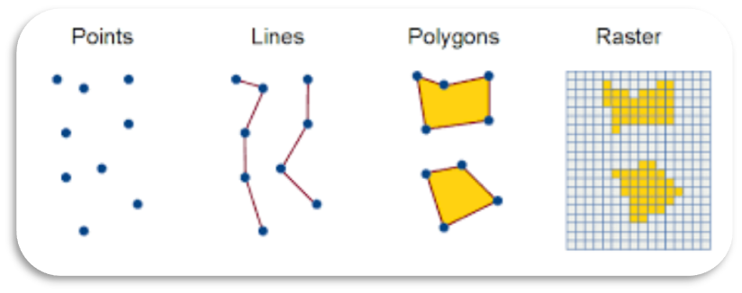

```{r setup, include= FALSE}
knitr::opts_chunk$set(echo = TRUE, message = FALSE, warning = FALSE, eval = FALSE)
```

## 1. Spatial Data Formats

**Vector Data**

-   Locations (points)

    -   Coordinates, address, country, city

-   Shapes (lines or polygons)

    -   Political boundaries, roads, building footprints, water bodies

**Raster Data**

-   Images (matrix of cells organized by rows and columns)

    -   Satellite imagery, climate, landcover, elevation

        {width="50%"}

## 2. Import and manipulate spatial data

Working in the same R Project you created in the Intro lesson, create a new R Markdown document for this lesson. You will also need a couple new R data packages to import some of the spatial data sets for this lesson.

We will be using the `tigris` package to import some vector data, and `elevatr` to import a raster data set of elevation. Make sure those packages are included in your 'setup.R' script, and run it at the top of your new R Markdown document.

```{r}
source("setup.R")
```

First, create a new directory in your project called 'data/' where you will be saving all the data used for this week's lesson.

### 2.1 Vector Data

### [`tigris`](https://github.com/walkerke/tigris)

### **Polygons**

All the data we are working with in this lesson is confined to the state of Colorado. Let's start by pulling in political boundaries for Colorado counties with the `tigris` package, which returns a shapefile consisting of polygons for each county.

```{r}
#| message: false
#| warning: false
#| results: hide

# download county shapefile for the state of Colorado
counties <- counties(state = "CO")
```

The `tigris` package is one of many data retrieval R packages that uses API calls to pull in data from various online/open databases directly into your R session, without the need to separately download. When you close out your R session, these 'temp' files are erased, so it does not use up any of your local storage. At the end of this lesson you will learn how to save shapefiles to your computer if you do in fact want to store and use them in the future (e.g., you manipulated a data set quite a bit and don't want to re-run the entire process every new R session).

### **Lines**

`tigris` has many other data sets in addition to political boundaries. Today let's work with another shapefile, importing roads for Larimer county, which returns a polyline dataset for all roads in Larimer County.

```{r}
roads <- roads(state = "CO", county = "Larimer")
```

### [`tmap`](https://r-tmap.github.io/tmap/)

Throughout this lesson we will be using the `tmap` package to produce quick static or interactive maps. It should be included in your setup script, but if not be sure to add it now.

`tmap` allows for both static ("plot" mode) and interactive ("view" mode) mapping options, which you can set using the function `tmap_mode()` . For today we will be making quick interactive plots. Once you set the mode with `tmap_mode()`, every plot call to `tmap` after that produces a plot in that mode.

```{r}
tmap_mode("view")
```

Lets view our Colorado counties and Larimer County roads shapefiles. To make a "quick thematic map" in `tmap` you can use the `qtm()` function. You can also use `tm_shape()` plus the type of spatial layer (e.g., `tm_polygons()`) to add your layers to the map if you want to customize the map a little more.

```{r}
#Using qtm
qtm(counties)+
  qtm(roads)

#Using tm_shape
tm_shape(counties)+
  tm_polygons()+
tm_shape(roads)+
  tm_lines()
```

Rendering the map may take a little while due to relatively large size of the `roads` object.

Mess around with this map a little bit. See that you can change the basemap, turn layers on and off, and click on features to see their attributes.

Let's inspect the spatial data sets a little more. What do you see when you run `class(counties)` ?

### [`sf`](https://r-spatial.github.io/sf/)

By default, the `tigris` package imports spatial data in `sf` format, which stands for 'simple features'. The `sf` package provides an easy and efficient way to work with vector data, and represents spatial features as a `data.frame` or `tibble` with a geometry column, and therefore also works well with `tidyverse` packages to perform manipulations like you would a data frame.

For example, we are going to do an exercise for the Poudre Canyon Highway, so we want to filter out the roads data set to only those features. Using your investigative geography skills, find the highway on your map, find out what the exact 'FULLNAME' attribute is, and use that to `filter()` the data set.

<details>

<summary>Show Answer</summary>

```{r}
poudre_hwy <- roads %>% 
  filter(FULLNAME == "Poudre Canyon Hwy")

qtm(poudre_hwy)
```

</details>

### Points

Most often when you are working with points, you start with an excel file or something similar that consists of the raw latitude and longitude. When you have spatial data that is not explicitly spatial yet or not in the `sf` format, you use the `st_as_sf()` function to transform it.

Lets work with a couple locations along the Poudre highway, making a small data frame of their coordinates:

```{r}
poudre_points <- data.frame(name = c("Mishawaka", "Rustic", "Blue Lake Trailhead"),
                            long = c(-105.35634, -105.58159, -105.85563),
                            lat = c(40.68752, 40.69687, 40.57960))
```

Now convert it to an `sf` object, specifying the longitude and latitude columns and the CRS (Coordinate Reference System). Note that 'x' (longitude) always goes first followed by 'y' (latitude).

```{r}
poudre_points_sf <- st_as_sf(poudre_points, coords = c("long", "lat"), crs = 4326)

qtm(poudre_hwy)+
  qtm(poudre_points_sf)
```

### Coordinate Reference Systems

Probably the most important part of working with spatial data is the coordinate reference system (CRS) that is used. In order to analyze spatial data, all objects should be in the exact same CRS.

We can check a spatial object's CRS by printing it to the console, which will return a bunch of metadata about the object. You can specifically return the CRS for `sf` objects with `st_crs()`.

```{r}
# see the CRS in the header metadata:
counties

#return just the CRS (more detailed)
st_crs(counties)
```

You can check if two objects have the same CRS like this:

```{r}
st_crs(counties) == st_crs(poudre_points_sf)
```

Uh oh, the CRS of our points and lines doesn't match. While `tmap` performs some on-the-fly transformations to map the two layers together, in order to do any analyses with these objects you'll need to re-project one of them. You can project one object's CRS to that of another with `st_transform` like this:

```{r}
poudre_points_prj <- st_transform(poudre_points_sf, st_crs(counties))

#Now check that they match
st_crs(poudre_points_prj) == st_crs(counties)
```

### 2.2 Raster Data

### [`elevatr`](https://github.com/jhollist/elevatr/)

Lets import some elevation data using the `elevatr` package. The function `get_elev_raster()` returns a raster digital elevation model (DEM) from the AWS Open Data Terrain Tiles. For this function you must supply a spatial object specifying the extent of the returned elevation raster and the resolution (specified by the zoom level `z`). We are importing elevation at \~ 1km resolution (more like 900 m), and we can use our `counties` object as the extent we want to download to, which will return elevation tiles for the state of Colorado.

```{r}
elevation <- get_elev_raster(counties, z = 7)
```

```{r}
qtm(elevation)
```

By default, `tmap` uses a categorical symbology to color the cells by elevation. You can change that to a continuous palette like this:

```{r}
tm_shape(elevation)+
  tm_raster(style = "cont", title = "Elevation (m)")
```

When we see this on a map, we see that it actually extends beyond Colorado due to how the Terrain Tiles are spatially organized.

Let's inspect this raster layer a little. By printing the object name to the console we see a bunch of metadata like resolution (cell size), extent, CRS, and file name.

```{r}
elevation
```

### `terra`

We can use the `terra` package to work with raster data. For example, we only want to see elevation along the Poudre highway. We can use `crop` to crop the raster to the extent of our `roads` shapefile (to get all of Larimer County), using the `ext()` function to get the extent of that spatial object.

```{r}
# If we try this, we get an error
elevation_crop <- crop(elevation, ext(poudre_hwy))

```

This doesn't work because our `elevation` object is actually not in the proper format to work with the `terra` package. The `elevatr` package still uses the `raster` package to work with raster data, however this package is outdated and we want to stick with `terra` for this course and any future work you do with raster data (note that the `elevatr` package maintainer says these dependencies will be updated in 2023).

Converting a RasterLayer object to a `terra` SpatRaster object is quick using the `rast()` function. Lets also give this layer a more informative name in the process.

```{r}
elevation <- rast(elevation)
names(elevation) <- "Elevation"
```

Now we can use `terra` functions

```{r}
elevation_crop <- crop(elevation, ext(roads))

tm_shape(elevation_crop)+
  tm_raster(style = "cont")
```

Lets make a final map with all the spatial data we created

```{r}
tm_shape(elevation, bbox = st_bbox(poudre_hwy))+
  tm_raster(style = "cont", title = "Elevation (m)")+
tm_shape(poudre_hwy)+
  tm_lines()+
tm_shape(poudre_points_prj)+
  tm_dots(size = 0.2)
```

## 3. Reading and Writing Spatial Data

### 3.1 Writing spatial data

All of the spatial data we've worked with are only saved as objects in our environment. To save the data to disk, the `sf` and `terra` packages have functions to do so. You are not required to save these files, but if you want to follow along with these functions save the data to the 'data/' folder you created at the beginning of this lesson.

To save vector data with `sf`, use `write_sf()`

```{r}
write_sf(poudre_hwy, "data/poudre_hwy.shp")

write_sf(poudre_points_prj, "data/poudre_points.shp")
```

While you can give the file any name you want, note that you must put '.shp' as the extension of the file.

To save raster data with `terra` use `writeRaster()`

```{r}
writeRaster(elevation_crop, "data/elevation_larimer.tif")
```

Same as with the vector data, when saving raster data you must add the '.tif' file extension to the name. There are various formats raster data can be stored as (e.g., ASCII, ESRI Grid) but GeoTiffs are the most common and generally easiest to deal with in R.

### 3.2 .RData Files

Another way you can store data is saving your environmental variables as R Data objects. You may have already seen '.RData' files in your folders before if you ever click 'yes' when closing out of RStudio asks you to save your workspace. What this does is save everything in your environment to a file with a '.RData' extension in your project directory, and then every time you open your project it reloads everything that was in the environment. This however is often poor practice, as it prevents you from writing reproducible code and all those variables start racking up storage space on your computer. We recommend changing this setting by going to Global Options and under 'Workspace' set 'Save workspace to .RData on exit' to '**Never**'.

However, there are times you may want to save your variables as R files, such as when you have a set of variables you want to quickly re-load at the beginning of your session, or some files that are pretty large in size (R object files are much smaller). You can save single or multiple variables to an .RData file, or single variables to an .RDS file.

Since the `poudre_hwy` and `poudre_points_prj` were objects you created in this session, to avoid the need to recreate them you can save them to an .RData file:

```{r}
save(poudre_hwy, poudre_points_prj, file = "data/spatial_objects.RData")
```

Note that you must add the 'file =' to your second argument.

Now to test out how .RData files work, remove them from your environment with `rm()` (*be careful with this function though, it is permanent!*) and load them back in with `load()`

```{r}
rm(poudre_hwy, poudre_points_prj)
```

See they are no longer in your Environment pane, but after you load the .RData file back in, it loads in those two objects with the same environmental names they were given when you saved them.

```{r}
load("data/spatial_objects.RData")
```

Note that `terra` objects don't properly save to .RData files, but there is a work around if you save a single `terra` object as an .RDS file. Here is that workflow, there is just a second step to 'unpack' the loaded .RDS object with `rast()`.

```{r}
saveRDS(elevation_crop, "data/elevation_crop.RDS")
```

```{r}
readRDS("data/elevation_crop.RDS") %>% rast()
```

Note that with .RDS files you must assign the loaded file to a new environmental variable (unlike with .RData that returns the objects with the exact names they had before).

### 3.3 Reading Spatial Data

To read in shapefiles, you use `read_sf()`

```{r}
read_sf("data/poudre_hwy.shp")
```

See that when you saved the shapefiles, there were many other auxiliary files saved with it. It is VERY important that whenever you share shapefiles, all the auxiliary files are saved with it, so often shapefiles are transferred via .zip folders. However, when reading shapefiles into R you only specify the file with the '.shp' extension. As long as all the other auxiliary files are saved in that same folder, it will read in the shapefile correctly.

To read in raster files you use the `rast()` function and file path with the appropriate file extension

```{r}
rast("data/elevation_larimer.tif")
```

Remember when reading in files you will want to assign them to a new variable name with `<-` to keep them in your environment.

### 4. Exercises

1.  Filter out the `counties` data set to only include Larimer, Denver, and Pueblo counties.

2.  Make a map of the `counties` data colored by county area. Make a second map of counties colored by their total area of water.

3.  Make a barplot comparing the elevation of your 3 points in the Poudre Canyon (note: explore the `extract()` function in the `terra` package).

4.  Why are there 4 features in our Poudre Canyon Highway variable instead of 1?
